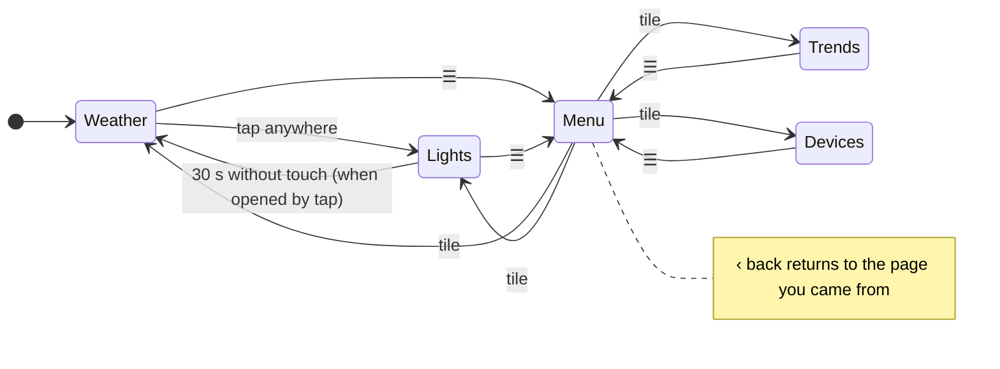
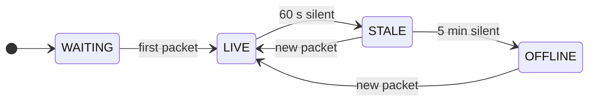
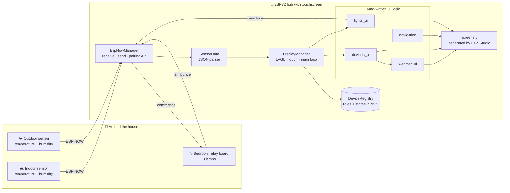
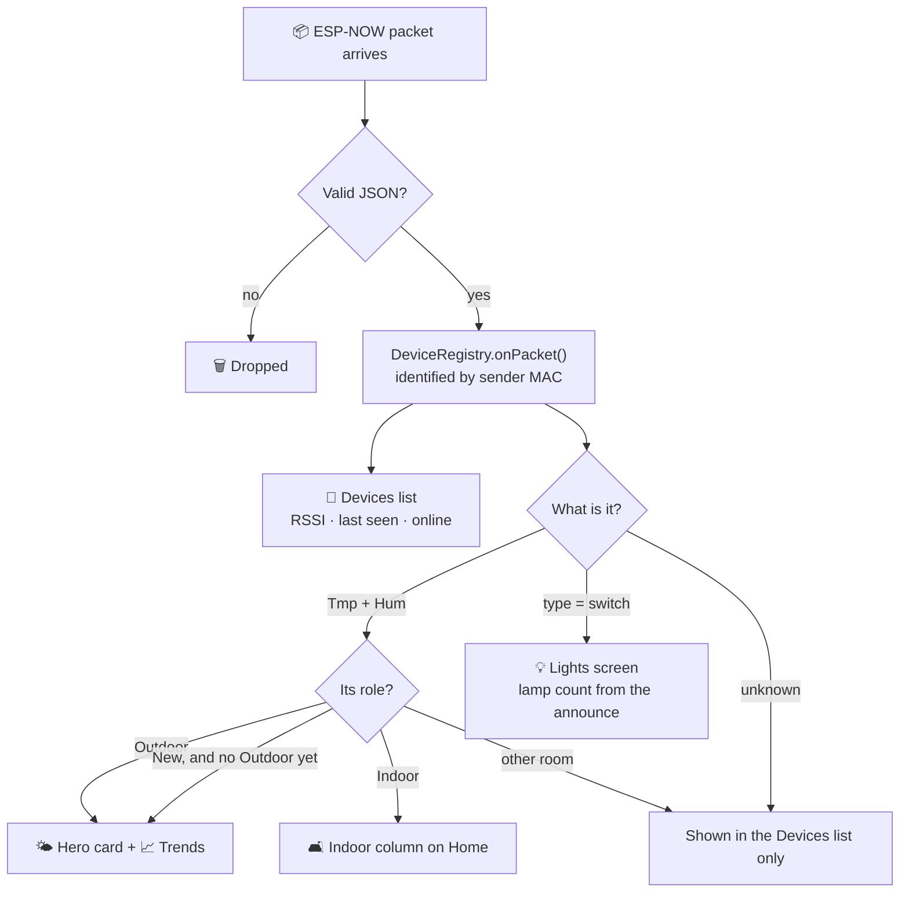
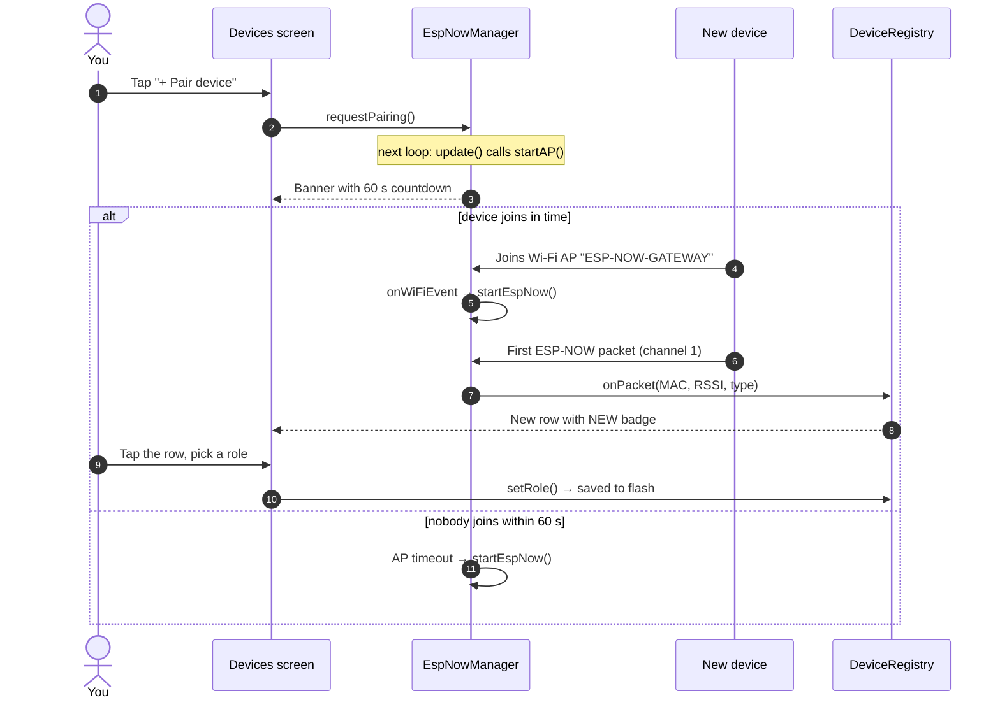
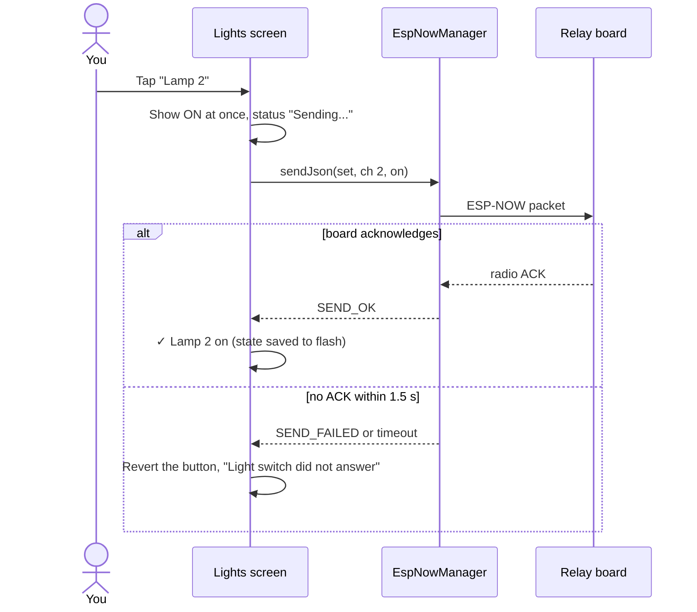
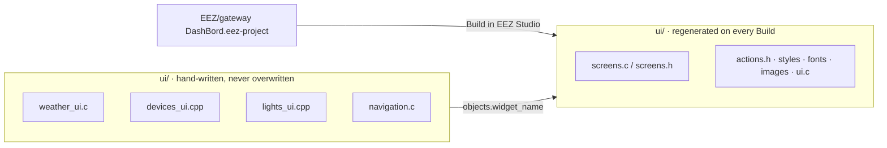
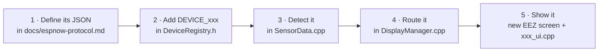

<div align="center">

# 🏡 IoT Network Gateway

### One touchscreen. Every sensor in the house. No router, no cloud.

An **ESP32 smart-home hub** that talks to your devices over **ESP-NOW**:
it shows live indoor and outdoor weather, switches your lamps, and lets you pair new devices from its own touchscreen.


</div>

---

> **Why this exists:** smart-home kits usually need Wi-Fi credentials, an app, and somebody's server.
> This hub needs **none of that**. Devices pair directly with the hub over ESP-NOW, data never leaves the house,
> and everything you need fits on a 320×240 touchscreen on your wall.
> Pick it up, add a device, and see what you can build. 🚀

---

## ✨ What it does

| | Feature | Details |
|---|---|---|
| 🌤️ | **Weather home screen** | Outdoor temperature in big digits, an animated sky icon, session high/low, humidity, dew point, comfort level and *feels like*, plus an **Indoor** column for the inside sensor. |
| 📈 | **Trends** | Live chart of the last 48 outdoor readings, temperature and humidity, with an auto-scaling axis. |
| 💡 | **Lights** | Three bedroom lamps on one ESP-NOW relay board: tap to switch, **All on / All off**, and an ✓/✗ for every command based on the radio-level delivery report. |
| 📡 | **Devices** | Every device is recognised by its **MAC address**, with signal strength, last-seen time, online/offline and a **NEW** badge. Assign a role (Outdoor, Indoor, Bedroom…) or forget a device. |
| 🔗 | **One-tap pairing** | **+ Pair device** opens the hub's access point for 60 s with a countdown banner. The new device joins and appears in the list. |
| 💾 | **Remembers everything** | Devices, roles and the last lamp states are saved in **flash (NVS)** and survive power cuts. |
| 🧭 | **Simple navigation** | Weather is home. Tap anywhere on it to open Lights (it returns home after 30 s without a touch). Every page has a **☰** menu. |
| 🎨 | **Editable UI** | All screens are designed in **EEZ Studio**, so you can restyle the dashboard visually without touching the logic. |

---

## 🖼️ The screens

```text
┌──────────────────────────────────┐   ┌──────────────────────────────────┐
│ [≡] Weather Station      ● LIVE  │   │ [≡] Lights               ● LIVE  │
│ ╭──────────────────────────────╮ │   │ Bedroom • 3 lamps  [On ] [Off ]  │
│ │ \|/  23.4°C        │ INDOOR  │ │   │ ╭────────╮ ╭────────╮ ╭────────╮ │
│ │-(O)- Partly Cloudy │ 22.1°   │ │   │ │  .--.  │ │  .--.  │ │  .--.  │ │
│ │ /|\  ▲27.1° ▼18.9° │ 45% RH  │ │   │ │ ( ** ) │ │ (    ) │ │ ( ** ) │ │
│ │                    ↻ 12s ago │ │   │ │  '--'  │ │  '--'  │ │  '--'  │ │
│ ╰──────────────────────────────╯ │   │ │ Lamp 1 │ │ Lamp 2 │ │ Lamp 3 │ │
│ ╭────────╮ ╭────────╮ ╭────────╮ │   │ │   ON   │ │  OFF   │ │   ON   │ │
│ │HUMIDITY│ │DEW PT. │ │COMFORT │ │   │ ╰────────╯ ╰────────╯ ╰────────╯ │
│ │ 56%    │ │ 14.2°  │ │ Ideal  │ │   │                                  │
│ │ ▓▓▓▓░░ │ │Pleasant│ │Feels 23│ │   │ ✓ Lamp 3 on                      │
│ ╰────────╯ ╰────────╯ ╰────────╯ │   │                                  │
└──────────────────────────────────┘   └──────────────────────────────────┘
          🏠 Home (Weather)                         💡 Lights

┌──────────────────────────────────┐   ┌──────────────────────────────────┐
│ [<] Menu                 ● LIVE  │   │ [≡] Devices              ● LIVE  │
│ ╭──────────────╮╭──────────────╮ │   │ 3 devices • 3 online   [+ Pair]  │
│ │ ⌂            ││ ϟ            │ │   │ ╭──────────────────────────────╮ │
│ │ Weather      ││ Lights       │ │   │ │ Outdoor           23.4°  56% │ │
│ │ Home screen  ││ Bedroom lamps│ │   │ │ C3:D4:E5 -61 dBm • Online 8s │ │
│ ╰──────────────╯╰──────────────╯ │   │ ╰──────────────────────────────╯ │
│ ╭──────────────╮╭──────────────╮ │   │ ╭──────────────────────────────╮ │
│ │ ⇄            ││ ((·))        │ │   │ │ Bedroom               2/3 on │ │
│ │ Trends       ││ Devices      │ │   │ │ 7A:8B:9C -55 dBm • Online 3s │ │
│ │ Outdoor hist.││ Pair & manage│ │   │ ╰──────────────────────────────╯ │
│ ╰──────────────╯╰──────────────╯ │   │ Hub 24:6F:28:… • Up 03:14:15     │
│                                  │   │                                  │
└──────────────────────────────────┘   └──────────────────────────────────┘
               ☰ Menu                                📡 Devices
```

### How you move around



### What the status pill (● LIVE) means

The pill in every header follows the **outdoor** sensor:



---

## 🧭 Architecture



### What happens to every packet



---

## 🔗 Pairing a new device

1. Open **☰ → Devices** and tap **+ Pair device**.
2. The hub opens its Wi-Fi access point **`ESP-NOW-GATEWAY`** for **60 s** (banner + countdown, LED blinks).
3. Power on the new device. It joins the access point and learns the hub's MAC address.
4. The hub switches straight back to ESP-NOW, and the device's first packet adds it to the list with a **NEW** badge.
5. Tap it and give it a role. **Outdoor** feeds the big card, **Indoor** the indoor column, **Bedroom** the Lights page.



> 💡 Outdoor and Indoor are **unique**: giving one of them to a device takes it away from the previous one.
> Until you choose an Outdoor sensor, any new temperature sensor feeds the big card, so the hub is useful straight after first boot.

---

## 💡 Switching a lamp

The relay board does not report its state. Even so, the hub does not trust a command blindly: ESP-NOW tells the sender
whether the board **received** the packet, and the screen reacts to that.



---

## 📜 The protocol in 30 seconds

Everything is small JSON text inside one ESP-NOW packet (max **127 bytes**), on **channel 1**.

| Direction | Message | When |
|---|---|---|
| Sensor → hub | `{"Tmp": 23.4, "Hum": 56, "key": 1}` | periodically |
| Relay board → hub | `{"type": "switch", "ch": 3}` | at boot, then every 60 s |
| Hub → relay board | `{"cmd": "set", "ch": 2, "on": true}` | on every tap (`ch: 0` = all lamps) |

📖 Full details and a ready-to-use receive handler for the lamp board: **[docs/espnow-protocol.md](docs/espnow-protocol.md)**

---

## 🛠️ Getting started

### What you need

| | |
|---|---|
| **Board** | ESP32 with a 320×240 SPI TFT and an XPT2046 touch controller. The pin mapping in [`display/DisplayManager.h`](display/DisplayManager.h) matches the ESP32-2432S028R ("Cheap Yellow Display"). |
| **Core** | Arduino ESP32 core **3.x** |
| **Libraries** | `lvgl` **9.4.0** · `TFT_eSPI` **2.5.43** · `XPT2046_Touchscreen` **1.4** · `ArduinoJson` **7.4** |
| **LVGL config** | Copy [`EEZ/lv_conf.h`](EEZ/lv_conf.h) to your Arduino `libraries/` folder, next to the `lvgl/` folder. It enables Montserrat **12 / 16 / 20 / 48** and `LV_USE_CHART`. Without them the build stops with a clear `#error`. |
| **Display config** | Copy [`display/TFT_eSPI_User_Setup.h`](display/TFT_eSPI_User_Setup.h) to `libraries/TFT_eSPI/User_Setup.h` (ILI9341 driver, HSPI pins, backlight on GPIO 21). |
| **Partition** | **Huge APP** (3 MB app, no OTA). The firmware is about 1.4 MB, more than the default 1.2 MB. |

### Build and flash

```bash
arduino-cli compile --fqbn esp32:esp32:esp32:PartitionScheme=huge_app \
  --build-property compiler.cpp.extra_flags=" -Idisplay -Iui -Iwireless -Isensors" -v .

arduino-cli upload -p COM4 --fqbn esp32:esp32:esp32:PartitionScheme=huge_app .
```

In the Arduino IDE, choose **Tools → Partition Scheme → Huge APP** and add the same include folders.

### ✅ Continuous integration

Every pull request to `dev` is compiled by GitHub Actions ([`.github/workflows/build.yml`](.github/workflows/build.yml))
with the same pinned core and library versions, `lv_conf.h` and display setup as above.
You can also start it by hand from the **Actions** tab (**Run workflow**).

---

## 🧩 Project structure

```text
iot-network-gateway/
├── iot-network-gateway.ino   ← setup() / loop(), #includes every source file (see note below)
├── wireless/
│   ├── EspNowManager.*       ← ESP-NOW receive/send, pairing access point, delivery reports
│   └── DeviceRegistry.*      ← devices by MAC, roles, lamp states, saved in NVS
├── sensors/
│   └── SensorData.*          ← parses incoming JSON (temperature/humidity, switch announce)
├── display/
│   ├── DisplayManager.*      ← TFT + touch + LVGL, routes packets to the UI
│   └── TFT_eSPI_User_Setup.h ← display driver + pins (copy into the TFT_eSPI library)
├── ui/
│   ├── screens.c/.h …        ← 🤖 generated by EEZ Studio, don't edit by hand
│   ├── weather_ui.c          ← ✍️ weather maths, icon animation, chart, status pill
│   ├── devices_ui.cpp        ← ✍️ device list, pairing banner, role dialog
│   ├── lights_ui.cpp         ← ✍️ lamp buttons, commands, ✓/✗ feedback
│   └── navigation.c          ← ✍️ menu, back, tap-to-Lights, 30 s auto-return
├── EEZ/
│   ├── gateway DashBord.eez-project   ← the visual UI design (open in EEZ Studio)
│   └── lv_conf.h                      ← LVGL configuration used by this project
└── docs/
    └── espnow-protocol.md    ← message formats for device firmware
```

> 📝 **Why the `.ino` includes `.c`/`.cpp` files:** Arduino only compiles sources in the sketch root and `src/`,
> so this project pulls every file into one translation unit. Two consequences:
> everything compiles as **C++**, and `static` names must be **unique across files**.

### 🎨 Editing the UI in EEZ Studio



Open the project, move, recolour or restyle anything, press **Build**, recompile. Three rules keep the logic working:

1. **Keep the widget names** (`temperature`, `chart`, `lamp_btn_1`, …). The hand-written files find widgets by those names.
2. **Change at most one flag per widget.** EEZ writes several flags as `A|B`, which does not compile as C++.
3. **On the Main screen, keep `home_touch_area` last**, just under the menu button: it is the invisible layer that makes "tap anywhere → Lights" work. To edit widgets underneath it, select them in the widget tree.

---

## ⚙️ Tuning knobs

| What | Where | Default |
|---|---|---|
| Status pill STALE / OFFLINE | `WX_STALE_MS` / `WX_OFFLINE_MS` in `ui/weather_ui.c` | 60 s / 5 min |
| Points on the trend chart | `WX_HISTORY_POINTS` in `ui/weather_ui.c` | 48 |
| Device shown as offline | `OFFLINE_MS` in `wireless/DeviceRegistry.h` | 5 min |
| Maximum devices | `MAX_DEVICES` in `wireless/DeviceRegistry.h` | 10 |
| Lights → Home auto-return | `NAV_LIGHTS_RETURN_MS` in `ui/navigation.c` | 30 s |
| Lamp command ACK timeout | `LT_ACK_TIMEOUT_MS` in `ui/lights_ui.cpp` | 1.5 s |
| Pairing window | `apDuration` in `wireless/EspNowManager.h` | 60 s |
| Max packet size | `MAX_JSON_SIZE` in `wireless/EspNowManager.h` | 128 (127 usable) |

---

## ➕ Add your own device type

The hub is built to grow. A door sensor, a smart plug, a soil-moisture probe: each one is the same five steps.



It shows up in the Devices list automatically, with pairing, roles, signal strength and online status already handled.

---

## 🩺 Troubleshooting

| Symptom | Check |
|---|---|
| Build stops with `Weather UI needs LV_FONT_MONTSERRAT_…` | Your `lv_conf.h` is not the one from `EEZ/`, so copy it next to the `lvgl/` library. |
| `text section exceeds available space` | Select the **Huge APP** partition scheme. |
| Device never appears after pairing | It must send on **channel 1** to the hub's MAC. Watch the Serial monitor (115200) for `Received from:`. |
| Status pill stuck on **STALE** | Your sensor sends less often than every 60 s: raise `WX_STALE_MS`. |
| Lamp says *did not answer* | Board powered? In range? Is it listening on channel 1? The hub only reports what the radio confirms. |
| Weather shows "Rain Likely" on a sunny day | The sky icon is an **estimate from humidity only** (the sensor has no light or pressure input). |

---

## 🗺️ Ideas for what's next

- [ ] Lamp board reports its real state (wall switches stay in sync)
- [ ] Room selector on the Lights page for more than one relay board
- [ ] More device types: door/window contact, smart plug, soil moisture
- [ ] Night mode: dim the backlight after inactivity
- [ ] Export readings to a microSD card

---

<div align="center">

**Built with an ESP32, a soldering iron and a lot of stubbornness.**
If it lights up your house, ⭐ the repo and go build the next device. 🔧✨

Made by [@dalilawini](https://github.com/dalilawini)

</div>
