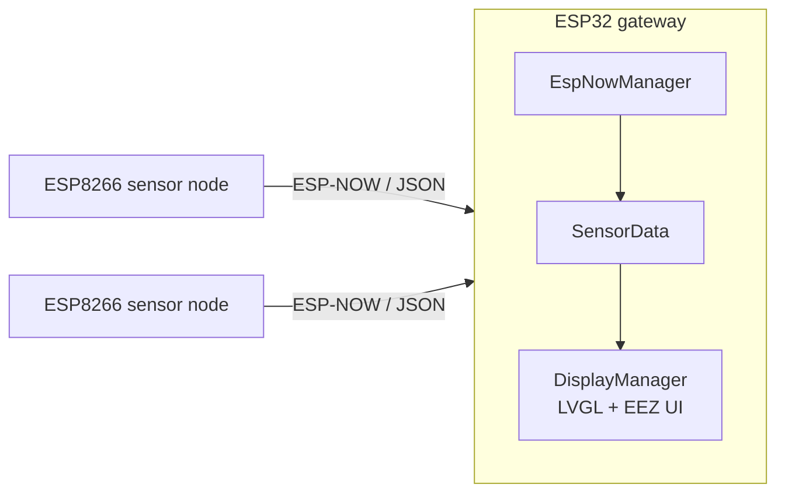

# IoT Network Gateway – ESP32

ESP32 gateway that receives sensor data from wireless nodes over **ESP-NOW**, parses it, and (in progress) shows it on an **LVGL touchscreen dashboard**.

It is the receiving side of my [weather-app](https://github.com/dalilawini/weather-app) project, where ESP8266 nodes read temperature and humidity and broadcast them over ESP-NOW.

## Features

- **ESP-NOW receiver** on Wi-Fi channel 1: receives JSON payloads from sensor nodes and logs the sender's MAC address
- **Sensor data model**: parses temperature, humidity and a node key from each message
- **Pairing / AP mode**: a button starts a Wi-Fi access point for 60 s (status LED blinks), then the gateway switches back to ESP-NOW when a station connects
- **Touchscreen dashboard** (in progress): UI designed in EEZ Studio, rendered with LVGL 9 on a 240×320 TFT with XPT2046 touch (ESP32-2432S028R "CYD" board)
- **CI**: GitHub Actions compiles the firmware with Arduino CLI on every pull request to `dev`

## Architecture



| Module | Role |
|---|---|
| `wireless/EspNowManager` | Wi-Fi/ESP-NOW setup, receive callback, AP pairing mode, status LED |
| `sensors/SensorData` | Parses the JSON payload (temperature, humidity, key) |
| `display/DisplayManager` | LVGL display driver, TFT_eSPI and XPT2046 touch input |
| `ui/`, `EEZ/` | Screens generated with EEZ Studio |
| `.github/workflows/build.yml` | CI build with Arduino CLI |

Example payload sent by a node:

```json
{ "Tmp": 23.5, "Hum": 48.0, "key": 1 }
```

The receive callback only copies the payload and sets a flag; parsing happens in the main loop, so the callback stays short.

## Hardware

- ESP32 (ESP32-2432S028R / "Cheap Yellow Display" for the dashboard)
- 240×320 TFT display with XPT2046 resistive touch
- Push button (GPIO 0) and status LED

## Build and flash

Requires [Arduino CLI](https://arduino.github.io/arduino-cli/) with the ESP32 core and these libraries: `ArduinoJson`, `lvgl@9.4.0`, `TFT_eSPI`, `XPT2046_Touchscreen`.

```bash
arduino-cli compile --fqbn esp32:esp32:esp32 \
  --build-property compiler.cpp.extra_flags="-Idisplay -Iui -Iwireless" -v .

arduino-cli upload -p COM4 --fqbn esp32:esp32:esp32 .
```

Replace `COM4` with your serial port (for example `/dev/ttyUSB0` on Linux).

## Roadmap

- [x] ESP-NOW reception and JSON parsing
- [x] AP pairing mode with timeout
- [x] CI build on pull requests
- [ ] Enable the LVGL dashboard in the main loop
- [ ] Track multiple nodes and their last-seen status
- [ ] Forward data to MQTT / a web dashboard
